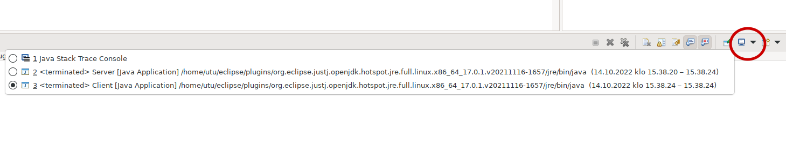

# Hajautetut järjestelmät demonstraatiokerta 2

## Demotehtäväpohjan käyttö
Koska demotehtäviä ei varsinaisesti palauteta, ei ole väliä, miten demopohjan itselleen hankkii (lataako ZIP-paketin suoraan gitlabista, kloonaako työn suoraan vai forkkaako työn ensin itselleen). Tässä kuitenkin esitetään, miten työ voidaan ensin forkata itselle ja tämän jälkeen kloonata Eclipseen. Myös muiden editorien ja IDE:iden kuin Eclipsen käyttö on toki sallittu.

### Demopohjan kopiointi omalle Gitlab-alueelle
- Valitse kyseisen viikon demopohjan Gitlab-sivulta toiminto "Fork" (oikea yläkulma)
- Valitse avautuvasta sivusta kopiointikohteeksi oma Gitlab-alueesi (pitäisi olla oletus)
- Tämä tekee sinulle oman kopion tehtäväpohjasta omalle Gitlab-alueellesi (eli gitlab.utu.fi/ututunnus) alle

### Paikallisen kopion hankkiminen
Kun sinulla on oma versio harjoitustyöstä GitLabissa, pitää siitä hankkia omalle koneelle (tai virtuaalikoneellensa) työkopio kloonaamalla

Mikäli käyttää Eclipseä kehitystyökaluna, helppo tapa on valita `File > Import... > Git > Projects from Git (with smart import)`. Avautuneesta dialogista valitaan "Clone URI" ja seuraavassa vaiheessa "URI"-kenttään liitetään oman projektikopion kloonausosoite. Eclipse osaa täydentää lähestulkoon kaikki tiedot automaattisesti osoitteesta, käyttäjänimeä ja salasanaa lukuunottamatta (mikäli käyttää HTTPS-osoitetta). Seuraavat vaiheet menevät aika pitkälti oletusasetuksilla. Kloonauksen jälkeen Eclipse osaa "Smart Importin" ansiosta myös automaattisesti tunnistaa, että kloonatussa projektissa oli mukana Maven-konfiguraatio, jonka perusteella mahdollisesti tarvittavat kirjastot ladataan automaattisesti.

Voit alkaa tekemään tehtäviä tämän jälkeen. Eclipse oletuksena käynnistää "Play"-painikkeesta avoinna olevan luokan main-metodin. Voit myös pakottaa tietyn luokan main-metodin suorittamisen avaamalla kyseisen luokan kontekstivalikosta "Run As > Java Application". **Demokerralla 3** joudutaan suorittamaan kahta sovellusta samaan aikaan (palvelimia ja asiakkaita). Näissä palvelimen voi käynnistää ensin ja sen jälkeen asiakkaan. Eclipse luo molemmille prosesseille oman konsolin, joiden välillä voi vaihdella kuvakaappauksen osoittamasta valikosta:

## Tehtävänanto
Tehtävänanto on saatavissa kohteessa [doc/tehtavananto.md](doc/tehtavananto.md)
